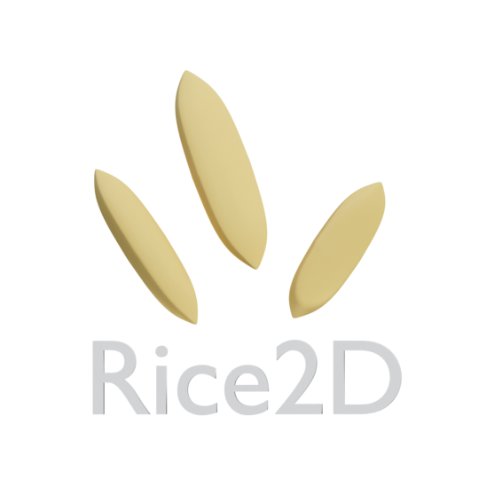
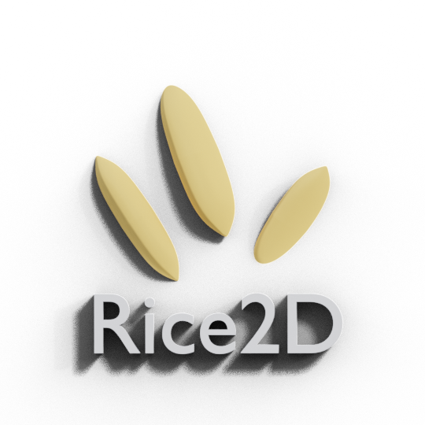

# Rice2D 🌾

**Rice2D** is data-driven cross-platform 2d game engine written in [Haxe](https://haxe.org/) and powered by [Kha](https://kha.tech/). It is inspired from Armory3D's Iron core engine architecture

Check out [empty rice project](https://github.com/BlackGoku36/Rice2D-Empty)