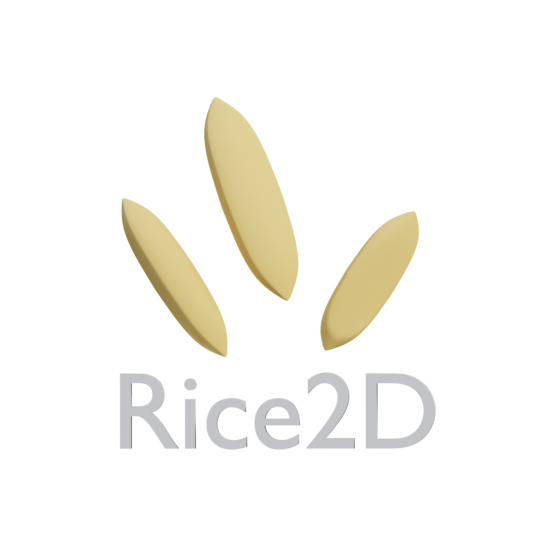

# Rice2D 🌾

**Rice2D** is data-driven cross-platform 2d game engine written in [Haxe](https://haxe.org/) and powered by [Kha](https://kha.tech/). It is inspired from Armory3D's Iron core engine architecture

Documentation is at [Rice2D-Docs (Web)](https://blackgoku36.github.io/Rice2D-Docs/#/), [Rice2D-Docs (Github)](https://github.com/BlackGoku36/Rice2D-Docs)

API Documentation is at [Rice2D-API (Web)](https://blackgoku36.github.io/Rice2D-API/rice2d/index.html), [Rice2D-API (Github)](https://github.com/BlackGoku36/Rice2D-API)

Check [CHANGELOG](CHANGELOG.md)

Check out [VSCode snippet](https://gist.github.com/BlackGoku36/e97d500547be88b3b2de5f2ea560372c)

Check out [empty rice project](https://github.com/BlackGoku36/Rice2D-Empty)

### Versioning

Versioning is based on year.month.day of release (e.g. 2019.11.16)
